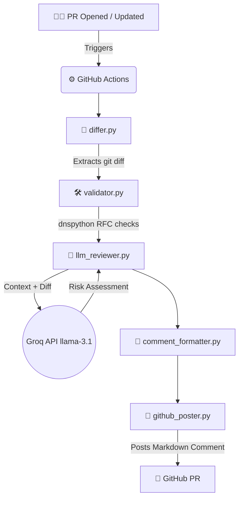

# 🔍 DNS Zone Reviewer Bot


## 📖 Overview
The **DNS Zone Reviewer** is an automated, AI-powered GitHub Action bot that intercepts, reviews, and assesses changes to DNS zone files during the Pull Request process. 

It instantly catches potentially catastrophic misconfigurations—such as wildcard records, missing Name Servers, or improperly cached TTLs—and provides a clear, human-readable risk assessment directly on the PR. This empowers engineering teams to catch infrastructure mistakes *before* they cause costly downtime.

## 🎯 Problem Statement (Hackathon Use Case)
**ID:** IM-08 | **Domain:** Infrastructure Maintenance

Risky DNS changes often slip through standard code review processes, leading to outages, security vulnerabilities, or misconfigurations. This project solves that by injecting a specialized deterministic validator combined with an LLM agent directly into the CI/CD pipeline.

## 🏗️ Architecture & Workflow

Whenever a developer opens a Pull Request modifying a `.txt` file in the `zones/` directory, the following automated pipeline triggers:



## 🛠️ Tech Stack
| Component | Technology |
|-----------|-----------|
| **CI/CD Orchestration** | GitHub Actions |
| **DNS Validation** | Python `dnspython` |
| **LLM Risk Analysis** | Groq API (`llama-3.1-8b-instant`) |
| **PR Integration** | GitHub REST API |
| **Testing** | Pytest (50 automated unit/integration tests) |
| **Language** | Python 3.11 |

## 🚀 Getting Started

### Cloud Setup (GitHub Actions)
To use this bot in another repository:
1. Copy the `.github/workflows/dns-review.yml` file into your repository.
2. Ensure your zone files are stored in the `zones/` directory using the `.txt` extension.
3. In your GitHub repository, go to **Settings ➔ Secrets and variables ➔ Actions**.
4. Add a repository secret named `GROQ_API_KEY` containing your Groq API key.
5. Create a Pull Request touching a zone file, and the bot will automatically awaken!

### Local Development Setup
1. Clone the repository:
   ```bash
   git clone https://github.com/shanks5017/dns-zone-reviewer.git
   cd dns-zone-reviewer
   ```
2. Set up the virtual environment and install dependencies:
   ```bash
   python -m venv .venv
   .\.venv\Scripts\Activate.ps1   # On Windows
   source .venv/bin/activate      # On Mac/Linux
   pip install -r requirements.txt
   ```
3. Create a `.env` file in the root directory:
   ```env
   GROQ_API_KEY=your_groq_api_key_here
   ```
4. Run the reviewer locally:
   ```bash
   python src/main.py
   ```

## 🧪 Testing
The project includes a robust test suite with 50 tests covering validation logic, GitHub API mocking, and LLM formatting fallbacks.
```bash
python -m pytest -v
```

## 🔐 Environment Variables
| Variable | Description | Where to Set |
|----------|-------------|--------------|
| `GROQ_API_KEY` | Required to query the Llama 3 LLM. | GitHub Secrets / `.env` file |
| `GITHUB_TOKEN` | Used to post comments on PRs. | Provided automatically by GitHub Actions |
| `GITHUB_REPOSITORY` | Repository context (e.g., `owner/repo`). | Provided automatically by GitHub Actions |
| `PR_NUMBER` | The PR ID to post the comment to. | Provided automatically by GitHub Actions |

## 👀 Sample PR Output
When the bot reviews a Pull Request, it generates an industry-grade report:

> ## 🔍 DNS Zone Review Bot — `zones/example.com.txt`
> 
> ### 📊 Risk Assessment
> | Field | Value |
> |-------|-------|
> | **Risk Level** | 🔴 CRITICAL |
> | **Safe to Merge** | ❌ No |
> | **LLM Model** | llama-3.1-8b-instant |
> 
> ### 🚨 Findings
> #### ❌ CRITICAL — Wildcard Record Detected
> **Why it's risky:** Wildcard DNS records can lead to massive security risks, including DNS amplification attacks and cache poisoning.
> **Recommendation:** Remove the wildcard DNS record or replace it with a more secure alternative.
> 
> ### ✅ Validator Results
> - Syntax valid: ✅ Yes
> - Errors: None
> 
> ### 💬 Reviewer Note
> Do not merge. Review wildcard record immediately.
> 
> ---
> <sub>🤖 Generated by DNS Zone Reviewer Bot</sub>

## 👥 Team
- **Team Name:** DNS Defenders
- **Project Link:** [GitHub Repository](https://github.com/shanks5017/dns-zone-reviewer)
