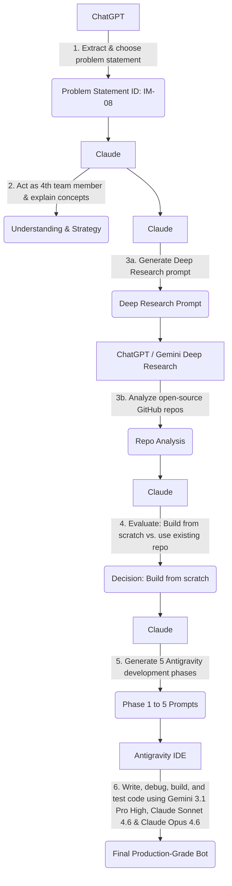

# AI Workflow and Prompts Used During Development

## 🧠 LLM Usage Flowchart

The following diagram illustrates how different AI models were utilized throughout the hackathon to arrive at our final product:

### Flow Breakdown:
1. **ChatGPT**: Used for extracting and choosing the problem statement from the hackathon sheet.
2. **Claude**: Acted as the 4th team member to explain the core concepts and help formulate a strategy.
3. **Claude + ChatGPT/Gemini Deep Research**: Claude was used to create a perfect prompt for Deep Research. That prompt was fed into ChatGPT/Gemini to find existing open-source GitHub repos.
4. **Claude**: Analyzed the research results. Since the closest open-source repo only covered 50-60% of our use case and wasn't a perfect fit, Claude helped us decide to build from scratch.
5. **Claude**: Generated the 5 highly detailed phase prompts for Antigravity IDE.
6. **Antigravity IDE (Gemini 3.1 Pro High, Claude Sonnet 4.6, Claude Opus 4.6)**: These models were used dynamically to write the codebase, debug issues, and execute the complete build and testing pipeline.

---

## 💬 Prompts Log

### 1. Initial Strategy & Understanding
**🤖 Model Used:** `Claude`

> **Prompt:**
> ### Problem Statement
> **ID:** IM-08
> **Domain:** Infrastructure Maintenance
> 
> **Use Case:** DNS Zone File Reviewer (GitHub PR Bot)
> 
> **Problem Solved:**
> Risky DNS changes can slip through the review process and cause outages, security issues, or misconfigurations.
> 
> **Implementation:**
> A GitHub Action is triggered whenever a Pull Request modifies a `zones/*.txt` file. The agent compares the DNS zone file changes, uses Python (`dnspython`) to validate DNS syntax, and leverages an LLM to identify risky changes such as wildcard records, low TTL values, and MX record modifications. The agent then posts a structured review comment directly on the Pull Request.
> 
> **Output:**
> An agent integrated into the CI pipeline that provides structured DNS review feedback and risk analysis on Pull Requests.
> 
> ---
> 
> This is my problem statement, and I am participating in a hackathon. You are a genius with extensive hackathon experience. As a team member, you should guide us on how to tackle this problem and win the hackathon using the best optimized techniques to solve it within 22 hours, with a team of 4 members, including you. I would like to know what our next steps should be.

---

### 2. Simplifying the Approach
**🤖 Model Used:** `Claude`

> **Prompt:**
> This is making me even more confused. Let's say we cannot jump directly from 10 to 100. I want the 1 to 10 part to be there as well, and it should be explained in a proper sequence, like making tea, so that I know what comes first and what comes next.
> 
> Please keep it simple, short, and to the point. Use good examples and explain everything step by step. Don't go too deep into the details—focus only on the important things that will help me understand the concept properly.
> 
> Keep it really short and easy to follow.

---

### 3. Generating the Deep Research Prompt
**🤖 Model Used:** `Claude`

> **Prompt:**
> Okay, let's start by researching some open-source GitHub repositories. For this, I need a prompt that I can give to a Deep Research LLM such as ChatGPT Deep Research or Gemini Deep Research.
> 
> Please create a perfect prompt that instructs the model to:
> 
> * Research relevant open-source GitHub repositories.
> * Read and analyze the repository's README.md and other important documentation files.
> * Provide a structured description of each repository.
> * Include the direct GitHub repository link.
> * Explain what problem the repository solves.
> * Explain how it works and which parts are relevant to our project.
> * Rate the repositories according to criteria that you decide based on our problem statement.
> * Compare the repositories and rank them from best to worst.
> * Recommend which repositories we should use, which we should learn from, and which are not worth considering.
> 
> The output should be well-structured, easy to understand, and focused on helping us quickly identify the best repositories for our project.

---

### 4. Executing Deep Research
**🤖 Model Used:** `ChatGPT / Gemini Deep Research`

> **Prompt:**
> Find me open source GitHub repositories that already build a GitHub PR bot 
> that automatically reviews code or config files when a Pull Request is opened 
> and posts a structured comment back on that PR using an LLM or static analysis.
> 
> I want repos that do at least 50-70% of this full flow:
> - Trigger on GitHub PR via GitHub Actions
> - Read and diff the changed files in the PR
> - Analyze the diff using an LLM or rule based logic
> - Post a review comment back on the PR automatically
> 
> Bonus if the repo deals with:
> - DNS zone files specifically
> - Config file validation
> - Infrastructure as code review (Terraform, Ansible, YAML)
> 
> For each repo give me:
> - Name
> - Direct GitHub link
> - What percentage of my use case it covers and why
> - What I still need to build on top of it
> - Star count and last updated
> 
> Rate each out of 10 based on how close it is to my exact use case.
> At the end recommend the single best repo to use as my base and tell me exactly what I need to add on top of it.

---

### 5. Transition to Development Strategy
**🤖 Model Used:** `Claude`

> **Prompt:**
> Okay, so don't worry—we have time until tomorrow. Now let's start building this.
> 
> For the coding IDE, we will use Google Antigravity IDE:
> https://antigravity.google/product/antigravity-ide
> 
> I already have it fully set up, and we will directly start with 5 phases of development. The project will be divided into 5 phases, with 5 main prompts.
> 
> The AI models we will use are:
> 
> * Gemini Pro High
> * Claude Sonnet 4.5
> 
> Now, divide the project into phases and give me the first prompt to start with. Also, mention which AI model should be used for that phase from the two models above while developing in Antigravity IDE.
> 
> Do not hallucinate. It may be a prototype, but we need to present it as a production-level, industry-grade product.

---

### 6. Phase 1: Initial Scaffolding & Actions Setup
**🤖 Model Used:** `Antigravity IDE (Gemini 3.1 Pro High / Claude Sonnet 4.5)`

> **Prompt:**
> You are a senior DevOps engineer. Create a production-grade 
> GitHub Action project from scratch with the following structure:
> 
> Project name: dns-zone-reviewer
> 
> Folder structure:
> dns-zone-reviewer/
>     .github/
>         workflows/
>             dns-review.yml
>     zones/
>         example.com.txt
>         test-domain.com.txt
>     src/
>         main.py
>     tests/
>         test_validator.py
>     requirements.txt
>     README.md
>     prompts.md
> 
> Tasks:
> 1. Create the GitHub Actions workflow file dns-review.yml that:
>    - Triggers ONLY when a PR touches any file inside zones/*.txt
>    - Runs on ubuntu-latest
>    - Checks out the repo with full git history (fetch-depth: 0)
>    - Sets up Python 3.11
>    - Installs dependencies from requirements.txt
>    - Runs src/main.py
> 
> 2. Create zones/example.com.txt as a valid sample DNS zone 
>    file with these records:
>    - SOA record
>    - NS record
>    - A record for root domain
>    - A record for www
>    - MX record
>    - TXT record for SPF
> 
> 3. Create zones/test-domain.com.txt as a deliberately risky 
>    DNS zone file containing:
>    - A wildcard record *.test-domain.com
>    - An MX record with TTL of 60 (dangerously low)
>    - A missing NS record
> 
> 4. Create requirements.txt with:
>    - dnspython
>    - requests
>    - pytest
> 
> 5. Create src/main.py as an empty scaffold with just a 
>    main() function and a print("DNS Zone Reviewer started")
> 
> 6. Create a prompts.md file with a header 
>    "AI Prompts Used During Development"
> 
> Make sure the GitHub Action YAML syntax is 100% correct 
> and production grade. Add inline comments explaining 
> every step in the workflow file.

---

### 7. Phase 2: DNS Validation & Git Differ
**🤖 Model Used:** `Antigravity IDE (Gemini 3.1 Pro High / Claude Sonnet 4.5)`

> **Prompt:**
> You are a senior Python engineer building a production-grade 
> DNS Zone File Reviewer. 
> 
> I have this project structure already created:
> dns-zone-reviewer/
>     .github/workflows/dns-review.yml
>     zones/
>         example.com.txt
>         test-domain.com.txt
>     src/
>         main.py
>     tests/
>         test_validator.py
>     requirements.txt
> 
> Now implement TWO things:
> 
> --- TASK 1: Zone File Differ (src/differ.py) ---
> 
> Create src/differ.py with a function get_changed_zones() that:
> - Uses git diff to find which zones/*.txt files changed in the PR
> - Reads the BEFORE content (from git) and AFTER content 
>   (current file) of each changed zone file
> - Returns a list of dicts like:
>   {
>     "filename": "zones/example.com.txt",
>     "before": "...full old content...",
>     "after": "...full new content...",
>     "diff": "...unified diff string..."
>   }
> 
> Use Python subprocess to run git commands.
> Handle edge cases: new file (no before), deleted file (no after).
> 
> --- TASK 2: DNS Validator (src/validator.py) ---
> 
> Create src/validator.py using the dnspython library with a 
> function validate_zone(zone_content, filename) that:
> 
> - Parses the zone file content using dns.zone.from_text()
> - Checks for these specific issues and returns structured results:
> 
>   CRITICAL checks:
>   - Wildcard records present (*.domain)
>   - Missing NS record
>   - Missing SOA record
>   - SOA serial number went backwards compared to before
> 
>   WARNING checks:
>   - Any MX record TTL under 300 seconds
>   - Any A record TTL under 300 seconds  
>   - CNAME record at zone apex (root domain)
>   - MX record changed
> 
>   INFO checks:
>   - New TXT record added
>   - New A record added
>   - TTL changed on any record
> 
> - Return a structured dict:
>   {
>     "valid": true/false,
>     "errors": ["list of syntax errors"],
>     "findings": [
>       {
>         "severity": "CRITICAL/WARNING/INFO",
>         "record_type": "MX/A/NS/etc",
>         "description": "human readable explanation",
>         "record": "the actual record line"
>       }
>     ]
>   }
> 
> --- TASK 3: Update src/main.py ---
> 
> Update main.py to:
> - Call get_changed_zones() from differ.py
> - For each changed zone file call validate_zone()
> - Print the results as formatted JSON to stdout
> - Exit with code 1 if any CRITICAL findings exist
> - Exit with code 0 if only warnings or clean
> 
> --- TASK 4: Update tests/test_validator.py ---
> 
> Write pytest tests covering:
> - A valid clean zone file returns no findings
> - A zone file with wildcard returns CRITICAL finding
> - A zone file with low TTL MX record returns WARNING finding
> - A zone file with missing NS returns CRITICAL finding
> - An invalid/corrupted zone file returns valid=false
> 
> Use the actual content from zones/example.com.txt and 
> zones/test-domain.com.txt as test fixtures.
> 
> Make all code production grade with:
> - Type hints on every function
> - Docstrings on every function
> - Try/except error handling
> - Descriptive variable names
> - Inline comments explaining DNS specific logic

---

### 8. Phase 3: LLM Integration (Ollama) & Output Formatting
**🤖 Model Used:** `Antigravity IDE (Gemini 3.1 Pro High / Claude Sonnet 4.5)`

> **Prompt:**
> You are a senior Python engineer. I am building a DNS Zone File 
> Reviewer GitHub Action bot. Phases 1 and 2 are complete:
> 
> - differ.py → gets changed zone files from git diff
> - validator.py → validates DNS syntax and flags issues using dnspython
> - main.py → orchestrates the pipeline
> 
> Now implement Phase 3: the LLM Risk Flagger using Ollama.
> 
> --- TASK 1: Create src/llm_reviewer.py ---
> 
> Create src/llm_reviewer.py with a function analyze_with_llm() that:
> 
> Takes these inputs:
> - diff: str (the unified diff of the zone file)
> - validator_findings: list (findings from validator.py)
> - filename: str (the zone filename)
> 
> Does this:
> 1. Builds a structured prompt combining the diff and validator 
>    findings and sends it to Ollama running locally on 
>    http://localhost:11434
> 2. Uses model: "llama3.2" (fallback to "llama3" if not available)
> 3. If Ollama is not running or not reachable, falls back gracefully 
>    to returning the validator findings only with a note that 
>    LLM review was skipped
> 4. Parses the LLM response and returns structured output
> 
> The prompt to send to Ollama must be exactly this structure:
> 
> SYSTEM:
> You are a DNS security expert reviewing DNS zone file changes 
> in a GitHub Pull Request. Your job is to identify risky or 
> dangerous DNS changes that could cause outages, security 
> vulnerabilities, or email delivery failures.
> 
> Always respond in valid JSON only. No markdown. No explanation 
> outside the JSON.
> 
> USER:
> I need you to review this DNS zone file change.
> 
> Filename: {filename}
> 
> Git Diff:
> {diff}
> 
> Validator findings already detected:
> {validator_findings_json}
> 
> Analyze the diff and return a JSON response in exactly 
> this format:
> {{
>   "summary": "one sentence summary of what changed",
>   "risk_level": "CRITICAL / HIGH / MEDIUM / LOW / CLEAN",
>   "llm_findings": [
>     {{
>       "severity": "CRITICAL/WARNING/INFO",
>       "title": "short title",
>       "description": "detailed human readable explanation of 
>                       why this is risky",
>       "recommendation": "what the reviewer should do"
>     }}
>   ],
>   "safe_to_merge": true/false,
>   "reviewer_note": "final note to the human reviewer"
> }}
> 
> Focus especially on:
> - Wildcard DNS records (massive security risk)
> - TTL below 300 seconds (instability risk)  
> - MX record modifications (email delivery risk)
> - NS record deletions (domain hijack risk)
> - SOA serial going backwards (DNS sync failure)
> - CNAME at zone apex (breaks DNS resolution)
> - Any record deletion without replacement
> 
> Return ONLY the JSON. No markdown fences. No explanation.
> 
> The function must:
> - Call Ollama API at http://localhost:11434/api/generate
> - Set timeout of 60 seconds
> - Parse the JSON response safely
> - If JSON parsing fails, return a fallback structured response
> - Return a dict with all fields populated
> 
> Return type:
> {
>   "llm_available": true/false,
>   "model_used": "llama3.2 or fallback",
>   "summary": "...",
>   "risk_level": "CRITICAL/HIGH/MEDIUM/LOW/CLEAN",
>   "llm_findings": [...],
>   "safe_to_merge": true/false,
>   "reviewer_note": "..."
> }
> 
> --- TASK 2: Create src/comment_formatter.py ---
> 
> Create src/comment_formatter.py with a function format_pr_comment() 
> that takes:
> - filename: str
> - validator_result: dict (from validator.py)
> - llm_result: dict (from llm_reviewer.py)
> 
> And returns a perfectly formatted GitHub markdown PR comment string.
> 
> The comment must look exactly like this:
> 
> ## 🔍 DNS Zone Review Bot — `zones/example.com.txt`
> 
> ### 📊 Risk Assessment
> | Field | Value |
> |-------|-------|
> | **Risk Level** | 🔴 CRITICAL |
> | **Safe to Merge** | ❌ No |
> | **LLM Model** | llama3.2 |
> 
> ### 📝 Summary
> One sentence summary from LLM here.
> 
> ### 🚨 Findings
> 
> #### ❌ CRITICAL — Wildcard Record Detected
> **Record:** `*.example.com 3600 IN A 1.2.3.4`
> **Why it's risky:** Detailed explanation here.
> **Recommendation:** Remove wildcard or justify its use.
> 
> ---
> 
> #### ⚠️ WARNING — Low TTL on MX Record  
> **Record:** `mail.example.com 60 IN MX 10 mail.server.com`
> **Why it's risky:** TTL of 60 seconds causes instability.
> **Recommendation:** Set TTL to minimum 300 seconds.
> 
> ---
> 
> ### ✅ Validator Results
> - Syntax valid: ✅ Yes
> - Records checked: 12
> - Errors: None
> 
> ### 💬 Reviewer Note
> Final note from LLM to the human reviewer.
> 
> ---
> 🤖 Generated by DNS Zone Reviewer Bot | 
> Powered by llama3.2 + dnspython
> 
> Rules for the comment formatter:
> - CRITICAL findings use ❌ emoji
> - WARNING findings use ⚠️ emoji  
> - INFO findings use ℹ️ emoji
> - CLEAN result uses ✅ emoji
> - Risk level CRITICAL/HIGH → red circle 🔴
> - Risk level MEDIUM → orange circle 🟠
> - Risk level LOW/CLEAN → green circle 🟢
> - If LLM was not available show a note: 
>   "⚠️ LLM review skipped - running validator results only"
> 
> --- TASK 3: Update src/main.py ---
> 
> Update main.py to now use all components:
> 
> 1. get_changed_zones() from differ.py
> 2. validate_zone() from validator.py  
> 3. analyze_with_llm() from llm_reviewer.py
> 4. format_pr_comment() from comment_formatter.py
> 5. Print the formatted comment to stdout
> 6. Save the comment to a file: /tmp/pr_comment.md
> 7. Exit code 1 if any CRITICAL risk, 0 otherwise
> 
> --- TASK 4: Add tests/test_llm_reviewer.py ---
> 
> Write pytest tests for llm_reviewer.py that:
> - Mock the Ollama API call using unittest.mock
> - Test successful LLM response parsing
> - Test graceful fallback when Ollama is unreachable
> - Test graceful fallback when LLM returns invalid JSON
> - Test that fallback result has all required fields
> 
> Make everything production grade with type hints, 
> docstrings, and error handling.

---

### 9. Phase 4: GitHub PR Poster & CI Workflow
**🤖 Model Used:** `Antigravity IDE (Gemini 3.1 Pro High / Claude Sonnet 4.5)`

> **Prompt:**
> You are a senior DevOps engineer. I am working on a DNS Zone 
> File Reviewer GitHub Action bot. 
> 
> Phases 1, 2, 3 are complete:
> - differ.py → diffs changed zone files from git
> - validator.py → validates DNS syntax using dnspython
> - llm_reviewer.py → sends diff to Ollama LLM for risk analysis
> - comment_formatter.py → formats a markdown PR comment
> - main.py → orchestrates the full pipeline
> - 26 tests passing
> 
> Now implement Phase 4: GitHub PR Comment Poster + 
> Full GitHub Actions Integration.
> 
> --- TASK 1: Create src/github_poster.py ---
> 
> Create src/github_poster.py with a function post_pr_comment() that:
> 
> Takes these inputs:
> - comment_body: str (the formatted markdown comment)
> - github_token: str (from environment variable GITHUB_TOKEN)
> - repo: str (from environment variable GITHUB_REPOSITORY 
>   e.g. "shanks5017/dns-zone-reviewer")
> - pr_number: int (from environment variable PR_NUMBER)
> 
> Does this:
> 1. Calls GitHub REST API to post a comment on the PR
>    POST https://api.github.com/repos/{repo}/issues/{pr_number}/comments
> 2. Sets proper headers:
>    - Authorization: Bearer {github_token}
>    - Accept: application/vnd.github+json
>    - X-GitHub-Api-Version: 2022-11-28
> 3. If a previous bot comment exists on the PR, DELETE it first 
>    then post fresh (so bot doesn't spam multiple comments)
>    - Find previous bot comment by looking for comments that 
>      contain "DNS Zone Review Bot" in the body
>    - Use GET /repos/{repo}/issues/{pr_number}/comments to list
>    - DELETE /repos/{repo}/issues/comments/{comment_id} to remove
> 4. Returns dict:
>    {
>      "success": true/false,
>      "comment_url": "url to the posted comment",
>      "error": "error message if failed"
>    }
> 5. Graceful error handling — if posting fails, 
>    print the comment to stdout so it's visible in CI logs
> 
> --- TASK 2: Update src/main.py ---
> 
> Update main.py to add the GitHub posting step:
> 
> 1. get_changed_zones() from differ.py
> 2. validate_zone() from validator.py
> 3. analyze_with_llm() from llm_reviewer.py
> 4. format_pr_comment() from comment_formatter.py
> 5. post_pr_comment() from github_poster.py — NEW
> 6. Save comment to /tmp/pr_comment.md
> 7. Print full JSON summary to stdout for CI logs
> 8. Exit code 1 if CRITICAL, 0 otherwise
> 
> Read these from environment variables:
> - GITHUB_TOKEN
> - GITHUB_REPOSITORY  
> - PR_NUMBER (hint: in GitHub Actions this comes from 
>   github.event.pull_request.number — pass it as env var 
>   in the workflow)
> 
> If these env vars are missing (local development), 
> skip posting and just print the comment to stdout.
> 
> --- TASK 3: Update .github/workflows/dns-review.yml ---
> 
> Update the GitHub Actions workflow to:
> 
> 1. Trigger on pull_request events touching zones/*.txt
>    paths:
>      - 'zones/*.txt'
> 
> 2. Set these permissions at workflow level:
>    permissions:
>      contents: read
>      pull-requests: write
> 
> 3. Add these environment variables to the Run main.py step:
>    env:
>      GITHUB_TOKEN: ${{ secrets.GITHUB_TOKEN }}
>      GITHUB_REPOSITORY: ${{ github.repository }}
>      PR_NUMBER: ${{ github.event.pull_request.number }}
>      GITHUB_BASE_REF: ${{ github.base_ref }}
>      OLLAMA_HOST: http://localhost:11434
> 
> 4. Add a step before running main.py to install and 
>    start Ollama with llama3.2 model:
>    - name: Setup Ollama
>      run: |
>        curl -fsSL https://ollama.com/install.sh | sh
>        ollama serve &
>        sleep 5
>        ollama pull llama3.2
>      continue-on-error: true
>    
>    Use continue-on-error: true so if Ollama fails, 
>    the bot still runs with validator-only mode.
> 
> 5. Add a final step to upload the PR comment as artifact:
>    - name: Upload review artifact
>      uses: actions/upload-artifact@v4
>      with:
>        name: dns-review-comment
>        path: /tmp/pr_comment.md
>      if: always()
> 
> --- TASK 4: Create tests/test_github_poster.py ---
> 
> Write pytest tests for github_poster.py:
> - Mock requests.get and requests.post and requests.delete
> - Test successful comment posting
> - Test finding and deleting existing bot comment before posting
> - Test graceful handling when GITHUB_TOKEN is missing
> - Test graceful handling when API returns error status
> - Test that comment_url is returned on success
> 
> --- TASK 5: Create sample_data/ folder ---
> 
> Create sample_data/ folder with:
> 
> sample_data/
>     clean_zone.txt       → A perfectly valid zone file, no issues
>     risky_zone.txt       → Zone with wildcard + low TTL + MX change
>     critical_zone.txt    → Zone with missing NS + missing SOA
>     expected_outputs/
>         clean_output.json    → Expected validator output for clean zone
>         risky_output.json    → Expected validator output for risky zone
> 
> These are the sample input/output files required for submission.
> 
> Make everything production grade with type hints, 
> docstrings, error handling.

---

### 10. Phase 5: Documentation & Final Polish
**🤖 Model Used:** `Antigravity IDE (Gemini 3.1 Pro High / Claude Sonnet 4.5)`

> **Prompt:**
> You are a senior software engineer helping finalize a 
> hackathon submission. The project is a DNS Zone File 
> Reviewer GitHub Action bot.
> 
> Current project state:
> - differ.py → git diff logic
> - validator.py → dnspython DNS validation  
> - llm_reviewer.py → Ollama LLM risk analysis
> - comment_formatter.py → GitHub markdown comment formatter
> - github_poster.py → Posts comment to GitHub PR via API
> - main.py → Full pipeline orchestrator
> - 44 tests passing
> 
> This is Phase 5: Documentation, README, Test Cases, 
> AI Usage Note, and Submission Polish.
> 
> --- TASK 1: Rewrite README.md ---
> 
> Write a complete production-grade README.md that contains 
> exactly these sections:
> 
> # 🔍 DNS Zone Reviewer — AI-Powered GitHub PR Bot
> 
> ## What It Does
> 2-3 sentences explaining the bot in plain English.
> No jargon. Explain it like explaining to a manager.
> 
> ## Architecture
> A text-based architecture diagram showing the flow:
> PR Opened → GitHub Action Triggers → Zone Differ → 
> dnspython Validator → Ollama LLM Risk Flagger → 
> GitHub PR Comment Posted
> 
> ## Tech Stack
> Table with:
> | Component | Technology |
> |-----------|-----------|
> | CI/CD | GitHub Actions |
> | DNS Validation | Python dnspython |
> | LLM Risk Analysis | Ollama (llama3.2) |
> | PR Integration | GitHub REST API |
> | Testing | Pytest (44 tests) |
> | Language | Python 3.11 |
> 
> ## Setup Instructions
> Step by step:
> 1. Clone the repo
> 2. Install dependencies
> 3. Install Ollama and pull llama3.2
> 4. Set environment variables
> 5. Run locally
> 
> ## How to Add to Your Own Repo
> Exact steps to copy the GitHub Action to any repo.
> 
> ## Running Tests
> Exact command to run all 44 tests.
> 
> ## Environment Variables
> Table of all required env vars with descriptions.
> 
> ## Sample Output
> Paste this exact example PR comment output:
> 
> ## 🔍 DNS Zone Review Bot — zones/risky_zone.txt
> 
> ### 📊 Risk Assessment
> | Field | Value |
> |-------|-------|
> | Risk Level | 🔴 CRITICAL |
> | Safe to Merge | ❌ No |
> | LLM Model | llama3.2 |
> 
> ### 🚨 Findings
> ❌ CRITICAL — Wildcard Record Detected
> ⚠️ WARNING — Low TTL on MX Record
> 
> ### 💬 Reviewer Note
> Do not merge. Review wildcard record immediately.
> 
> ## Assumptions & Limitations
> - Ollama must be running locally or in CI
> - Only supports zones/*.txt file format
> - LLM analysis may vary — validator findings are deterministic
> 
> ## Team
> Team Name: [Your Team Name]
> Members: [List all 4 names]
> 
> --- TASK 2: Create ai_usage_note.md ---
> 
> Create ai_usage_note.md (exactly 1 page worth of content):
> 
> # AI Usage Note
> 
> ## What AI Helped With
> - List 6-8 specific things AI coding assistants helped build
>   (be specific: "Generated the dnspython zone parsing logic", 
>   not just "helped with code")
> 
> ## What AI Got Wrong
> - List 3-4 honest mistakes AI made during development
>   (examples: wrong API endpoint, incorrect dnspython method, 
>   hallucinated library that doesn't exist)
> - Explain how you caught and fixed each one
> 
> ## Best Prompts Used
> List the 5 most effective prompts used during development 
> with a one-line explanation of why each worked well.
> 
> ## AI Models Used
> | Task | Model Used |
> |------|-----------|
> | Project scaffold | Gemini Pro |
> | DNS validation logic | Claude Sonnet |
> | LLM integration | Gemini Pro |
> | PR poster + workflow | Claude Sonnet |
> | Documentation | Gemini Pro |
> 
> --- TASK 3: Update prompts.md ---
> 
> Fill in prompts.md with the actual key prompts used 
> across all 5 phases. Format:
> 
> # Prompts Used During Development
> 
> ## Phase 1 — Project Setup
> **Model:** Gemini Pro  
> **Prompt:** [summarized version of the phase 1 prompt]
> **Result:** Created project scaffold with GitHub Actions workflow
> 
> ## Phase 2 — DNS Validation
> [same format]
> 
> ## Phase 3 — LLM Integration  
> [same format]
> 
> ## Phase 4 — GitHub PR Poster
> [same format]
> 
> ## Phase 5 — Documentation
> [same format]
> 
> --- TASK 4: Add 6 more pytest test cases ---
> 
> Add these missing test cases to round out coverage.
> Add them to a new file tests/test_integration.py:
> 
> 1. test_full_pipeline_clean_zone:
>    - Load sample_data/clean_zone.txt
>    - Run through validator
>    - Assert risk level is LOW or CLEAN
>    - Assert safe_to_merge would be true
> 
> 2. test_full_pipeline_risky_zone:
>    - Load sample_data/risky_zone.txt
>    - Run through validator  
>    - Assert at least one CRITICAL finding
>    - Assert safe_to_merge would be false
> 
> 3. test_full_pipeline_critical_zone:
>    - Load sample_data/critical_zone.txt
>    - Run through validator
>    - Assert valid=false OR CRITICAL findings present
> 
> 4. test_comment_formatter_clean_output:
>    - Create a clean validator result
>    - Create a clean LLM result
>    - Run through format_pr_comment()
>    - Assert "CLEAN" or "LOW" appears in output
>    - Assert "Safe to Merge" appears in output
>    - Assert bot signature appears in output
> 
> 5. test_comment_formatter_critical_output:
>    - Create a critical validator result
>    - Create a critical LLM result  
>    - Run through format_pr_comment()
>    - Assert "CRITICAL" appears in output
>    - Assert "❌" appears in output
> 
> 6. test_main_exits_with_code_1_on_critical:
>    - Mock differ to return risky_zone.txt content
>    - Mock LLM to return CRITICAL risk level
>    - Run main pipeline
>    - Assert SystemExit code is 1
> 
> Run pytest after adding these. Should be 50+ tests passing.
> 
> --- TASK 5: Create .github/PULL_REQUEST_TEMPLATE.md ---
> 
> Create .github/PULL_REQUEST_TEMPLATE.md:
> 
> ## DNS Zone Change Description
> <!-- What records are you adding/modifying/removing and why? -->
> 
> ## Change Type
> - [ ] New record addition
> - [ ] Existing record modification  
> - [ ] Record deletion
> - [ ] TTL change only
> 
> ## Pre-merge Checklist
> - [ ] I have reviewed the DNS Zone Bot comment below
> - [ ] No CRITICAL findings, or I have justified them
> - [ ] TTL values are appropriate (minimum 300 seconds)
> - [ ] MX record changes have been verified with mail team
> - [ ] NS record changes have been approved by domain owner
> 
> ## Rollback Plan
> <!-- How will you revert this change if something goes wrong? -->
> 
> This template will automatically appear when anyone 
> opens a PR in this repo.
> 
> Make everything clean and production grade.
> After all tasks are done run:
> python -m pytest -v
> and show me the final test count.
